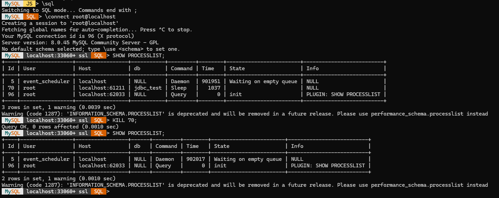
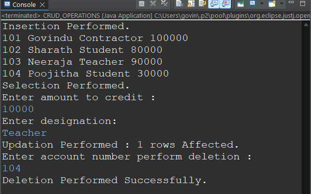
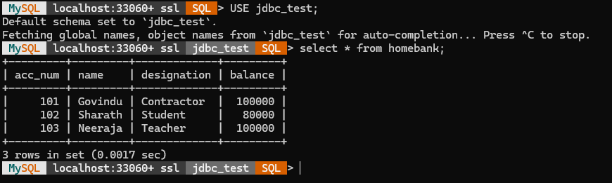

# JDBC CRUD Operations Project

## Overview

This project is a Java-based JDBC CRUD Operations application integrated with MySQL database. The application demonstrates how Java applications interact with relational databases using JDBC (Java Database Connectivity).

The project performs core database operations such as inserting, updating, deleting, and retrieving records while following secure database interaction practices using `PreparedStatement`.

---

## About JDBC

JDBC (Java Database Connectivity) is a Java API that enables communication between Java applications and databases.

### JDBC Workflow

1. Load the JDBC Driver
2. Establish Database Connection
3. Create Statement / PreparedStatement
4. Execute SQL Queries
5. Process Results
6. Close Database Resources

---

## Features

✔ Insert Records into Database
✔ Update Existing Records
✔ Delete Records
✔ Fetch and Display Records
✔ PreparedStatement for Secure Queries
✔ Exception Handling
✔ MySQL Database Connectivity
✔ Console-based User Interaction

---

## Technologies Used

* Java
* JDBC
* MySQL
* Eclipse IDE

---

## Project Structure

```text
jdbcTest/
│
├── src/
│   └── com/jdbcTest/
│       ├── CRUD_OPERATIONS.java
│       └── Main.java
│
├── lib/
│   └── mysql-connector-j-9.7.0.jar
│
├── screenshots/
│   ├── mysql-lock-debugging.png
│   ├── crud-console-output.png
│   └── mysql-database-output.png
│
└── README.md
```

---

## Database Connectivity

The project connects Java application with MySQL database using JDBC DriverManager and executes SQL queries through PreparedStatement.

Example:

```java
Connection con = DriverManager.getConnection(url, username, password);
```

---

## Screenshots

### MySQL Lock Debugging

Demonstrates resolving database lock timeout issues using `SHOW PROCESSLIST` and `KILL` command.



---

### CRUD Operations Console Output

Successful execution of Insert, Select, Update, and Delete operations using JDBC.



---

### MySQL Database Records

Final database records stored in MySQL after CRUD operations.



---

## Learning Outcomes

Through this project, I gained practical experience in:

* JDBC Architecture
* Database Connectivity
* SQL Query Execution
* CRUD Operations
* Exception Handling
* Debugging Database Lock Issues
* Managing Database Resources Efficiently

---

## Challenges Faced

During development, I encountered and resolved:

* Database lock timeout issues
* Running transaction conflicts
* NullPointerException while closing resources
* JDBC connection handling problems

These challenges improved my backend debugging and problem-solving skills.

---

## Future Improvements

* Implement DAO Design Pattern
* Add Menu-driven Interface
* Improve Project Structure
* Add Input Validation
* Migrate to Spring Boot REST APIs

---

## Author

Sharath Dhadipogu

## Acknowledgement

Special thanks to Rohit Ravinder Sir from Tap Academy for guiding the concepts clearly and patiently throughout the learning process.
